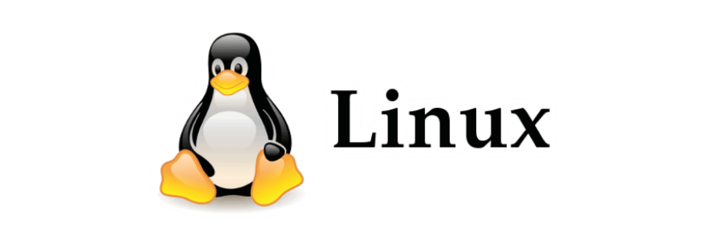

# Linux | Kali | Parrot | VM | Cyber Security | Ethical Haking

> 
"  Some people have told me they don't think a fat penguin really embodies the grace of Linux, which just tells me they have never seen an angry penguin charging at them in excess of 100mph. They'd be a lot more careful about what they say if they had. "<h3><strong> ~ Linus Torvalds </strong></h3>

 
<!-- TABLE OF CONTENTS -->

  
Table of Contents

  <ol>
    <li><a href="#about-this-repository">About This Repository</a></li>
    <li>
      <a href="#getting-started">Getting Started</a>
      <ul>
        <li><a href="#virtual-machine">Virtual Machine</a></li>
        <li><a href="#linux-distributions">Linux distributions</a></li>
      </ul>
    </li>
    <li><a href="https://github.com/mehediishere/Linux/tree/master/Ultimate%20Linux%20Command%20Cheat%20Sheet">Linux Cheat Sheet</a></li>
    <li><a href="#contributing">Contributing</a></li>
    <li><a href="#license">License</a></li>
    <li><a href="#contact">Contact</a></li>
    <li><a href="#acknowledgements">Acknowledgements</a></li>
  </ol>

<!-- ABOUT THE PROJECT -->
## About This Repository

(Once Upon A Time Me to my Friend 😗 while opening his laptop... 💻)  
Me: huh! Oh boy that's a cool windows setup bro 🤩 
Friend: Idiot. That's Linux 😶 
Me: Ohh Haaaakkeeerrrr.... 😎  
Hello there... **First time checking this repo!** Then let us dive into the world of hacking oh no no I mean the world of Linux. 😷 
The goal of this project is to explore and be familiar with Linux and as I said let's mark our name on the field of ~~ you might have already guessed that 😁  
Well, we'll explore [Kali Linux Tools Listing](https://tools.kali.org/tools-listing) as well as some others. Note to be taken I'm not a professional one in this field, just a learner out of personal interest. So don't forget to contribute if possible to make the learning scope larger and make your contribution to cybersecurity.

<!-- GETTING STARTED -->
## Getting Started

Let's setup a secure environment so that even if things go wrong while learning and experimenting we can always start from the beginning safely.
 
>Below these are my personal recommendation to set up your lab. You are free to use any **virtual machine** and **Linux distribution** you are comfortable with.

### Virtual Machine
1. VMware Workstation Player or
2. VirtualBox

### Linux Distributions
1. Kali Linux or
2. Parrot Linux

<!-- CONTRIBUTING -->
## Contributing

Contributions are what make the open source community such an amazing place to be learn, inspire, and create. Any contributions you make are **greatly appreciated**.

1. Fork the Project
2. Create your Feature Branch
3. Commit your Changes
4. Push to the Branch
5. Open a Pull Request

<!-- LICENSE -->
## License

Distributed under the MIT License. Check [MIT LICENSE](https://choosealicense.com/licenses/mit/) for more information.

<!-- CONTACT -->
## Contact
Feel free to contact with me if you need or stack on something. 
Mehedi Hasan - mehedihasanp78@gmail.com | [Linkedin](https://www.linkedin.com/in/mh-mehedi-hasan/)

 

Special thanks to <a href="https://github.com/othneildrew/Best-README-Template">othneildrew</a>. This markdown file inspire from his open source work.

